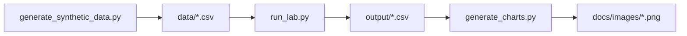

# Great Expectations Data Quality Lab

**Author:** [Faiz Elahi](https://github.com/faizilahi) (`faizilahi`) · **Type:** EDUCATIONAL LAB · **Synthetic data only**

---

## Educational disclaimer

This is an **educational portfolio lab**. Datasets are **synthetic**. It does **not** claim employment at a customer, hospital, bank, SAP shop, or Oracle estate. No real PHI/PII. No live cloud spend. No API keys required.

---

## Problem statement

Boards need failing tests before publish — uniqueness, nulls, accepted values — not only dashboard eyeballing.

**Domain focus:** Shift-left data quality

---

## Why this tool (Great Expectations-style expectation suites)

| Manual spot checks | Expectation suite in git |
|---|---|
| Silent null spikes | Explicit fail report |

---

## Architecture



See [`docs/architecture.md`](docs/architecture.md).

---

## Dataset dictionary

| File | Notes |
|------|-------|
| `data/members.csv` | Synthetic |
| `expectations/suite.yml` | Rules |
| `output/summary.csv` | Pass/fail |

---

## Prerequisites

- Python 3.10+
- Packages in `requirements.txt`

---

## How to run

```powershell
cd "great-expectations-data-quality-lab"
python -m venv .venv
.\\.venv\Scripts\Activate.ps1
pip install -r requirements.txt
python scripts/generate_synthetic_data.py
python src/run_lab.py
python scripts/generate_charts.py
```

Inspect `output/summary.csv` and `docs/images/primary_metric.png`.

---

## Local vs cloud (honest)

Minimal expectation runner in Python (GE-shaped). Full Great Expectations OSS optional; no cloud GE.

---

## Results interpretation

Open `output/` CSVs and the PNGs under `docs/images/`. Numbers are synthetic teaching fixtures — use them to explain grain, filters, and control totals, not as real business KPIs.

---

## Limitations

- Stand-in engines (DuckDB/SQLite/pandas) replace paid MPP/warehouses where noted.
- Simplified schemas vs production SAP/Oracle/Hive estates.
- Charts are matplotlib teaching visuals, not vendor BI embeds.

---

## Exercises

1. Add a regex expectation on member_id.
2. Fail volume anomaly vs yesterday.
3. Wire suite into an Airflow gate note.

---

## License / attribution

Educational portfolio content by Faiz Elahi. Synthetic data for teaching only.

